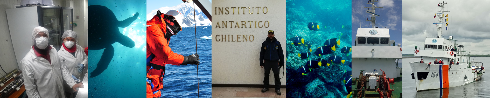

### 2012

* Biólogo - Docente Universitario Hora Cátedra, Universidad del Valle, Santiago de
*Cali*, Valle del Cauca, Colombia. *Docente del curso Biología de la Conservación*.
  * Dictar tres horas semanales de clases para estudiantes de 4 semestre;
  * Preparar y dictar los talleres y discusiones de artículos sobre biología de la conservación.

### 2010 - 2012

* *Biólogo - Docente Pre-Universitario, Universidad del Valle, Santiago de Cali, Valle
del Cauca, Colombia. *Docente del curso Biología General en el programa preuniversitario de la Alcaldía de Cali ”Plan Talentos”*.
  * Dictar clases magistrales para estudiantes de preuniversitario durante toda la semana;
  * Preparar talleres para la presentación del exámen de estado SABER 11
Habilidades.

### 2010
* Biólogo - Docente Universitario Hora Cátedra, Universidad del Valle Sede Pacífico,
Buenaventura, Valle del Cauca, Colombia
Docente del curso Biología de la Conservación.

Detalle de logros:

  * Dictar tres horas semanales de clases para estudiantes de 4 semestre;
  * Preparar y dictar los talleres y discusiones de artículos sobre biología de la conservación.

### 2006

* Biólogo - Docente Capacitación, Grupo de Investigaciones Entomológicas, Universidad
del Valle, Bucaramanga, Santander, Colombia. *Docente en el taller de capacitación para el control biológico de *Aedes aegypti* en el departamento de Santander, municipio de Bucaramanga, dictado para funcionarios del Instituto Nacional de Salud, División ETV (Enfermedades transmitidas por Vectores)*.

  * Dictar capacitación para los funcionarios de la secretaría de salud de Santander, sobre el contro biológico de *Aedes aegypti* en la ciudad de Bucaramanga;
  * Asistir a los funcionarios de la secretaría de salud en el establecimiento de un criadero de peces guppys *Poecillia reticulata*, para el control biológico de *Aedes aegypti* en la ciudad de Bucaramanga y el departamento de Santander.

### 2005

* Biólogo - Docente Universitario Hora Cátedra, Universidad del Valle Sede Pacífico,
Buenaventura, Valle del Cauca, Colombia
Docente del curso para la carrera de biología: Zoología de Artrópodos y Laboratorio de Zoología
de Artrópodos
Detalle de logros:
  * Dictar tres horas semanales de clases para estudiantes de 4 semestre;
  * Preparar y dictar las prácticas de laboratorio de Zoología de Artrópodos.

  